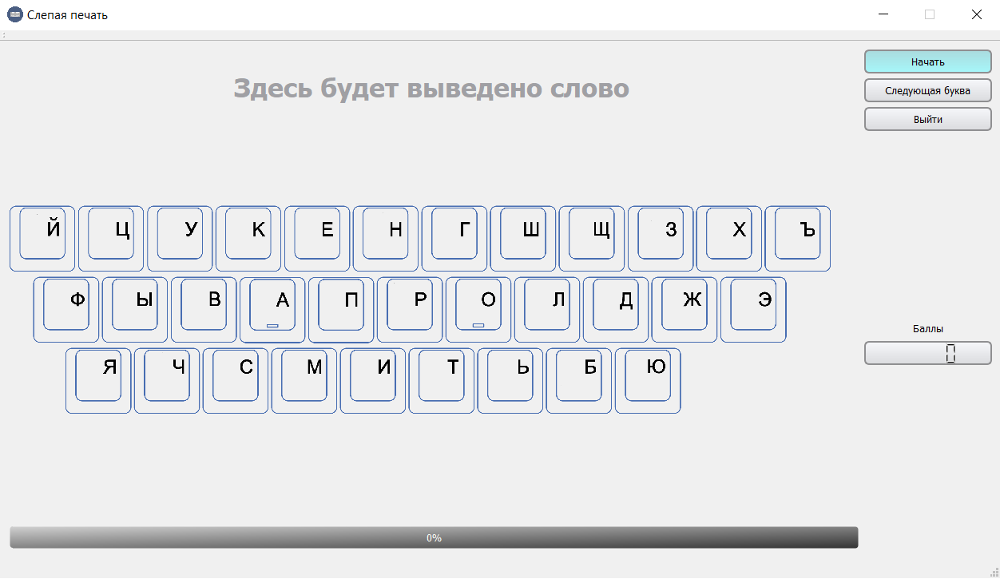
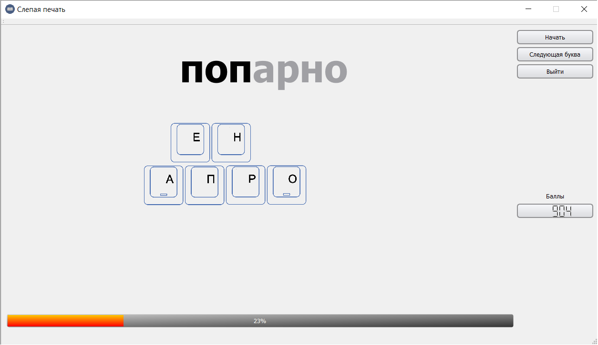

# Qt-BlindTyping

Программа для тренировки слепого набора.
Постепенно, начиная от центра клавиатуры, на экране появляются клавиши.

Задача: смотря только на экранную клавиатуру, набрать на физической клавиатуре слово, которое высветилось на экране.
Если пользователь допустил ошибку в слове, данное слово не будет засчитано за выполненное и в случайном порядке ещё раз появится на экране.
Кнопка "Следующая буква" открывает на экранной клавиатуре новую букву, а слова выводимые на экран будут иметь в своём составе данную букву.

В данной версии программы не используются:
1. Буква "Ё";
2. Слова, содержащие дефис "-";
3. Словосочетания и предложения.

В данной версии программы используются:
1. Слова с заглавными буквами.
	Для перехода в верхний регистр зажать "Shift".

Главное меню

